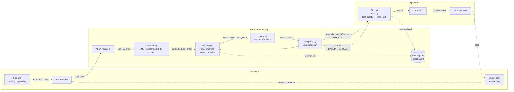
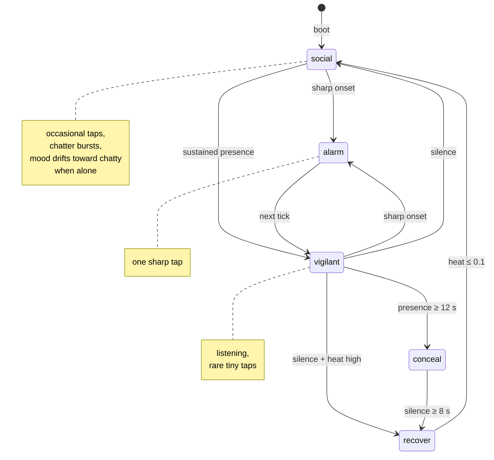

# object-ecology

A networked cybernetic art installation in which ordinary objects —
each with internal actuators, sensors, and local autonomy — behave
like animals under disturbance: socializing when alone, listening
when watched, refusing when asked to do more than is safe.

```text
central room brain proposes behavior
local node verifies safety
object may refuse
refusal is logged
refusal becomes part of the artwork
```

## What this is

This is not a chatbot, a pet, a responsive toy, or a smart device. The
engineering frame is ethology: each object is modeled as a small animal
in a room, and the humans who enter that room are modeled as nonlethal
predators in the sense of Frid & Dill's *risk-disturbance hypothesis* —
their mere presence raises the cost of every behavior the animal would
otherwise express. An object alone in an empty room socializes
quietly. The same object with humans in the room goes vigilant, hides,
or freezes. Whether it ever speaks again is a function of how long the
humans stay, how loud they get, and how the object's internal "energy"
budget recovers.

Two other ideas thread through the work. The first is the *security
dilemma* from international-relations theory (Jervis, 1978): defensive
moves can be mistaken for aggression. An object going silent can read,
to the audience or to a neighbouring object, as panic or threat. The
second is *refusal*. The room brain proposes behavior. The object's
local firmware enforces its own safety budget — pulse cap, cooldown,
heat ceiling — and will refuse commands that would exceed it. Every
refusal is recorded as a first-class event, not an error. The fact
that the object can say no is the artwork.

## Status

A complete proof of concept. One physical object node (a metal can with
a 24 V solenoid, code-named `CAN_01`) is fully wired and runs the
autonomous behavior loop end-to-end. The architecture, firmware,
host-side software, and wiring spec are specified for an eight-node
gallery installation; scaling to that needs studio time for the
multi-node cable assembly and the per-object enclosure build.

> Scaling to the 8-node gallery installation is straightforward but
> requires studio time and resources — the design, firmware, host
> software, and wiring spec are all in this repo.

### Working (1-node proof of concept)

- Raspberry Pi Pico W node, MicroPython firmware, USB-CDC to host.
- Real 24 V Heschen HS-0530B solenoid through a MOSFET driver, verified
  firing at 20 / 30 / 50 / 80 ms pulse widths with no heat issues.
- Hardware-Timer-enforced absolute pulse cutoff in firmware — the gate
  goes LOW even if Python execution hangs mid-pulse.
- Four-layer safety: host central rate limits, host transport guard,
  firmware per-command checks, hardware Timer ISR + external gate
  pulldowns.
- Audio presence detection from a USB audio interface (M-Audio M-Track
  Duo) via an `arecord` subprocess — smoothed dBFS plus an onset
  detector.
- Five-state ethology behavior loop: *social / vigilant / alarm /
  conceal / recover*.
- Auto-calibrating ambient threshold (rolling 20th-percentile of recent
  dBFS) so behavior is robust across mic gain and room conditions.
- Habituating vigilance delta — repeated sustained presence raises the
  trigger threshold (the object gets used to you), sharp onsets snap it
  back down.
- Circadian rhythm multiplier on tap probability — sinusoidal curve
  peaking at 14:00, troughing at 02:00, ratio 3.5×.
- Chatter gesture — short bursts of quiet pulses (firmware command of
  its own, atomic execution under per-pulse safety).
- Self-noise blanking — the agent mutes its own presence detector
  around its own actuations, breaking the acoustic feedback loop.
- Refusal-as-data: every refused command logged with reason to
  `logs/events.jsonl`.
- 4 passing unit tests, systemd template for unattended operation.

### Planned / specified but not yet built

- Vibration motor (parts on the bench; pin GP14 reserved in firmware).
- ToF proximity sensor on Pico I²C (Phase 3).
- Eight-node spider cable assembly converging on a single DD-50
  connector, with one Waveshare isolated USB-RS485 box per channel at
  the central hub.
- Per-object plinths / enclosures.
- Long-term observation runs with and without humans.
- Behavior parameter tuning from real-world deployment data.

## How it works



The microphone hears the room. ALSA delivers raw PCM samples to
`hub/presence.py`, which computes RMS over 100 ms windows, smooths
the dBFS reading, and watches for onsets (sharp jumps above the recent
baseline). The agent (`hub/ecology.py`) wakes every ~2 seconds, reads
the latest presence snapshot, polls the node for its current heat/mood
state, runs the state machine, and decides what (if anything) to do.

If the agent wants to speak, it asks the host central safety layer for
permission. Central safety rate-limits per-node events as a coordination
ceiling but is intentionally generous; the authoritative mechanical
safety lives further down the stack. If permitted, the transport
encodes a JSON command and writes it to the Pico's USB serial port.

The Pico's firmware (`firmware/pico_node/main.py`) parses the command,
runs its own local safety checks (pulse-duration cap, cooldown timer,
rolling duty-cycle budget, heat ceiling, quiet-mode guard), and only
then drives the GPIO pin that opens the MOSFET. Every pulse is bracketed
by a one-shot `machine.Timer` ISR that will force the pin LOW after the
absolute hardware cap — even if the Python interpreter itself hangs
during the pulse. The MOSFET switches 24 V to the solenoid coil.
The solenoid plunger strikes the object.

The strike produces an acoustic event that the mic will pick up. To
prevent the agent treating its own clicks as a new onset (and
triggering an infinite alarm cascade), the agent briefly *blanks* the
presence detector around every actuator command. Real acoustic events
from the room still register cleanly.

Every command attempted — accepted, refused, or errored — is appended
to `logs/events.jsonl` with full safety status and timing. Refusals
are not errors to hide; they're part of the record.

## Behavior



**social** is the baseline. The object occasionally taps or chatters,
driven by a mood parameter that random-walks within bounds and *drifts
upward* during sustained quiet — the longer the object is alone, the
more lively it becomes. The probability of speaking on any given tick
is also multiplied by a circadian curve that peaks at 14:00 and
troughs at 02:00, so the object has a diurnal rhythm independent of
acoustic conditions.

**vigilant** is the response to sustained presence in the room.
The object becomes mostly quiet — only the rarest, smallest taps —
and waits to see whether the disturbance escalates or fades.

**alarm** is the response to a sharp acoustic onset: a clap, a slam,
a loud voice. The object fires one hard tap, then immediately drops
to vigilant. Alarm taps are exempt from the circadian curve — a
sleeping animal still wakes to threat.

**conceal** is what happens if presence persists for too long. The
object goes fully silent and stays that way until the room quiets
down for several seconds, at which point it transitions to recover.

**recover** is a forced cooldown when the firmware-modeled heat is
high, or after a long conceal. Silent, waiting for the (software)
coil temperature to fall back near zero before returning to social.

Mood, the habituating vigilance delta, and the circadian phase all
update every tick and shape what *would* otherwise be a simple state
machine. Mood drift accumulates the longer the room is calm; the
vigilance threshold relaxes if presence is sustained without sharp
onsets (the object gets used to you) and snaps tighter on any onset.
The combination produces behavior that isn't metronomic — long
stretches of silence, then a small flurry, then quiet again, with the
specific texture varying by time of day and recent history.

## Hardware

### Per object (current 1-node build)

- Raspberry Pi Pico W running MicroPython 1.28
- Heschen HS-0530B 24 V push-pull solenoid (ED% = 5%)
- Logic-level N-channel MOSFET module (the "PWM trigger" style)
- 1N4007 flyback diode across the solenoid coil
- Mean Well HDR-60-24 DIN-rail PSU (60 W, mains AC in via crimped ferrules)
- Inline 1.5 A fuse on the 24 V rail; 10 kΩ gate pulldown; 100 Ω gate series resistor

### Host side (current 1-node setup)

- A Linux box ("room-brain") with USB and audio in
- M-Audio M-Track Duo (or any USB audio interface ALSA recognizes)
- Python 3.10+ for the host services

### Host side (planned 8-node setup)

- Same host
- 8 × Waveshare isolated USB-RS485 boxes in a passive central hub
- One *spider* cable: eight individual 3–4-conductor shielded
  twisted-pair runs (one per object) converging on a single DD-50
  connector at the hub
- Per-plinth AC drop (each plinth has its own Mean Well; only RS485
  signal crosses the spider)

Full per-node wiring spec at [`firmware/pico_node/WIRING.md`](firmware/pico_node/WIRING.md).
Multi-node topology design in [`readme-brief.md`](readme-brief.md).

## Running it

### Install

Copy the repo onto the room-brain, then:

```bash
cd /opt/object-ecology
python3 -m venv .venv
. .venv/bin/activate
pip install -r requirements.txt
chmod +x tools/*
```

`pyserial` and `mpremote` are needed for the serial transport and
firmware upload; `numpy` is needed for the audio presence detector.
The fake transport runs on the Python standard library alone — `import
serial` is lazy and only happens when `room.transport.mode = "serial"`.

The config files in `config/` are intentionally JSON-shaped YAML so
they can be parsed without PyYAML on a fresh server.

### CLI tools

From the project root:

```bash
tools/scan                                              # list configured nodes + serial ports
tools/ping-node CAN_01                                  # PONG round-trip
tools/tap-node CAN_01 --duration-ms 50                  # one solenoid pulse
tools/chatter-node CAN_01 --count 4 --pulse-ms 12       # burst of 4 quick clicks
tools/vibrate-node CAN_01 --duration-ms 500             # (LED-only until motor wired)
tools/quiet-node CAN_01                                 # kill switch
tools/monitor --iterations 3                            # poll node state
tools/seeing-object CAN_01                              # autonomous ecological loop
```

### Autonomous run

```bash
tools/seeing-object CAN_01 | tee logs/seeing-object.log
```

This launches the full audio-presence + state-machine loop. Every tick
prints a trace line; every command also lands in `logs/events.jsonl`.
Ctrl-C is a clean shutdown — the agent sends `QUIET` to the node before
exiting as a safety kill-switch. For overnight runs, drive it inside
`screen` or `tmux` so SSH disconnect doesn't stop it.

### Wiring the Pico

Full firmware upload and wiring steps are in
[`firmware/pico_node/README.md`](firmware/pico_node/README.md) and
[`firmware/pico_node/WIRING.md`](firmware/pico_node/WIRING.md).
The short version:

1. Flash MicroPython onto the Pico W (one-time UF2 drag-and-drop).
2. `mpremote connect /dev/ttyACM0 cp firmware/pico_node/main.py :main.py && mpremote connect /dev/ttyACM0 reset`
3. Point `config/room.yaml` `transport.mode` at `serial` and
   `config/nodes.yaml` `transport_channel` at `serial`; set the
   device to the Pico's stable by-id path.
4. `tools/ping-node CAN_01` — Pico LED blinks, host gets a PONG.

Firmware ships with `SOLENOID_ENABLED = False` so a fresh upload
behaves identically to LED-only Phase 1 until the wiring is verified.

## Layout

```
config/                   # JSON-shaped YAML — room, nodes, safety budgets
firmware/pico_node/       # MicroPython firmware + protocol spec + wiring guide
hub/                      # Host-side Python: protocol, transports, agent, presence
tools/                    # Thin CLI wrappers
tests/                    # unittest suite (4 tests)
systemd/                  # Service template for unattended operation
logs/                     # Runtime — events.jsonl, health.jsonl, fake-node state
readme-brief.md           # Full design notebook (long-form)
```

## Protocol

Messages are line-delimited JSON so they can later be sent over
serial / RS485.

Commands:

- `PING`
- `REQUEST_STATE`
- `TAP`
- `CHATTER`
- `VIBRATE`
- `QUIET`
- `SET_MODE`
- `RESET_FATIGUE`

Responses:

- `PONG`
- `STATE`
- `ACK`
- `ERROR`
- `SAFETY_REFUSAL`

Every message includes `timestamp`, `message_type`, `node_id`,
`correlation_id`, `payload`, and `safety_status`.

## Safety and refusal

Four layers, from highest to lowest, each able to deny independently:

1. **Host central safety** (`hub/safety.py`): emergency-quiet flag,
   per-node and total per-minute event rate limits, optional duration
   clamping.
2. **Host transport guard** (`hub/transports.py`): synthetic `ERROR`
   responses on timeout / I/O failure so the room-brain loop never
   crashes on a missing or unplugged node.
3. **Firmware command checks** (`firmware/pico_node/main.py`):
   mirror of the central node-safety budget. Pulse cap, cooldown
   timer, rolling duty-cycle window, heat / fatigue ceiling, quiet
   mode. Per-command for `TAP`, `CHATTER`, `VIBRATE`.
4. **Hardware-Timer pulse cutoff** (`machine.Timer` ISR + external
   gate pulldown): the actuator pin is forced LOW after the absolute
   max pulse duration regardless of what Python is doing.

The firmware persists its heat / fatigue model across commands within
a boot. A node that tapped one second ago will still know it is
cooling down when the next command arrives. Refusals are recorded with
a `reason` field (`cooldown_active`, `max_pulse_duration_exceeded`,
`rolling_duty_cycle_exceeded`, `fatigue_heat_limit`,
`node_quiet_mode`, etc.) so the artwork has a structured account of
its own restraint.

## Logs

Command events: [`logs/events.jsonl`](logs/) — every command attempt,
with timestamp, node id, command, requested payload, central safety
decision, node response type, node response payload, response safety
status, transport mode, and correlation id.

Health records: [`logs/health.jsonl`](logs/) — periodic node state
snapshots from `tools/monitor` and the main loop.

Refusals are not errors to hide. They are first-class events.

## Running tests

```bash
python3 -m unittest discover -s tests
```

The current suite covers protocol round-tripping, fake-node behavior,
and safety refusal. The firmware-side and audio-presence layers are
exercised by integration runs, not unit tests.

## Systemd template

The service file in `systemd/object-ecology.service` is a template.
Do not enable it until manual tests pass:

```bash
sudo cp systemd/object-ecology.service /etc/systemd/system/object-ecology.service
sudo systemctl daemon-reload
sudo systemctl enable object-ecology.service
sudo systemctl start object-ecology.service
```

## Roadmap

### Done

- **Phase 0** — spine: config loading, line-delimited JSON protocol,
  fake-node simulator, central + node-local safety budgets,
  append-only JSONL logs, CLI tools, systemd template, unit tests.
- **Phase 1** — USB-CDC serial transport (`hub/transports.py`),
  Pico W MicroPython firmware mirroring the fake node's safety model.
- **Phase 2** — real solenoid through MOSFET, hardware Timer ISR
  pulse cutoff, per-actuator enable flags defaulting OFF, wiring
  spec at `firmware/pico_node/WIRING.md`.
- **Behavior layer** — audio presence (`hub/presence.py`), five-state
  ecological agent (`hub/ecology.py`), circadian rhythm, chatter
  gesture (firmware command + agent integration), self-noise blanking.

### Next, in studio order

1. Wiring vibration motors (parts on bench; same MOSFET pattern on GP14
   from Pico 3V3 OUT), not needed for proof of concept (same behvaior as solenoids, easier wiring, less mechanical fuss over heating).
2. Adding the ToF sensor on Pico I²C; further telemetry.
3. Long-term observation runs: empty-room baseline, with-humans
   sessions. Tune behavior parameters from real data. Currently, it has run without error for 4 hours, but longer tested is needed.
4. RS485 multi-node deployment (designed but not yet
   built). Eight-node spider cable, DD-50 fan-in, isolated USB-RS485
   per channel.
5. Multi-object behavior couplings – pairs and groups of
   objects responding to each other's gestures, the full
   security-dilemma dynamic across the population.

## References

- Frid, A. & Dill, L. (2002). *Human-caused Disturbance Stimuli as a
  Form of Predation Risk*. Conservation Ecology 6(1).
- Jervis, R. (1978). *Cooperation Under the Security Dilemma*. World
  Politics 30(2).

## Acknowledgments

Made by Sebastian Suarez-Solis, CalArts.
